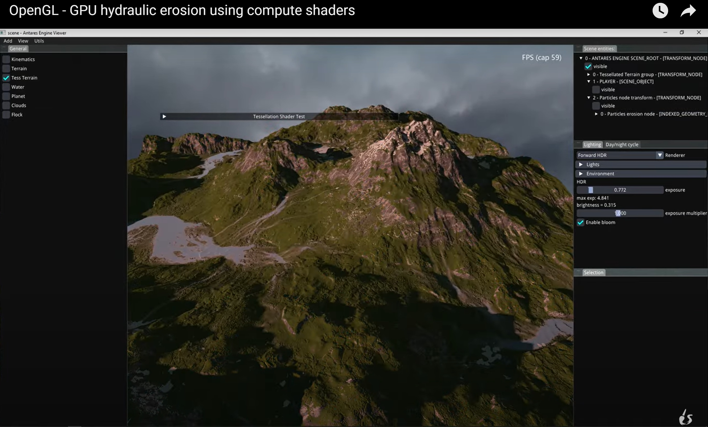

# Antares Engine
Simple game engine built with C++ and OpenGL.

List of the current features provided by the engine:

. normal mapping
. parallax occlusion mapping (with self shadowing)
. shadow mapping (directional and omnidirectional)
. advanced bloom (via downsampling)
. basic inverse kinematics
. camera path interpolation
. billboards
. displacement mapping via tessellation shaders
. procedural wind
. procedural terrain generation
. realistic terrain rendering using tessellation shaders
. snow accumulation based on daily sun exposure
. PBR
. HDR and dynamic exposure
. Global Illumination via Voxel Cone Tracing
. hydraulic erosion on the GPU
. day/night cycle
. BOIDS
. procedural planets generation
. basic translucency effect
. basic skeletal animation
. instancing
. volumetric clouds
. planar reflections
. parallax corrected cubemap reflections
. frustum culling

